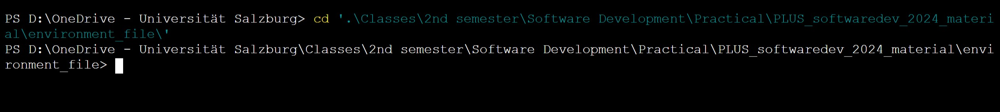
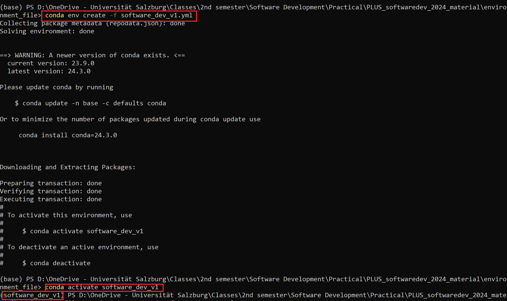
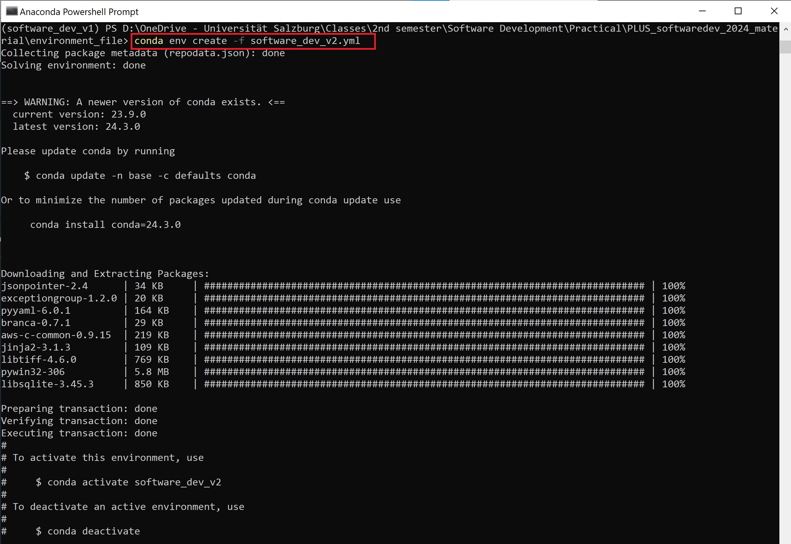

## Assignment A2

### Steps:

Instead of cloning the whole repo for a few files, I decided to download the required files.

1. Downloaded files are moved to the required directory. I intend to keep the environment in this director:
    './environment_file/'.

    

2. In the terminal, go to the directory where the downloaded files were moved.

3. Use the following command to create the first environment using 'software_dev_v1.yml' file:
    ```
    conda env create -f software_dev_v1.yml
    ```
   This will create an environment with the name specified in 'name'.

    


4. Similarly, using the 'software_dev_v2.yml' file, another environment is created as follows:
    ```
    conda env create -f software_dev_v2.yml
    ```
    


# PLUS_softwaredev_2024_materials
Software Development course materials are available here.
Just for demo.

This is the edit from the readme-edits for demonstration.

- adding a new file, by Gernot

******************
I guess you also heard that quote "Do or Die" 
I didn’t like sour flavor
German word "genaú" means exactly :)
If you don't have read "Who Moved my Cheese" by "Spencer Johnson" you must read that. It’s a beautiful novel highly recommended :)
    

